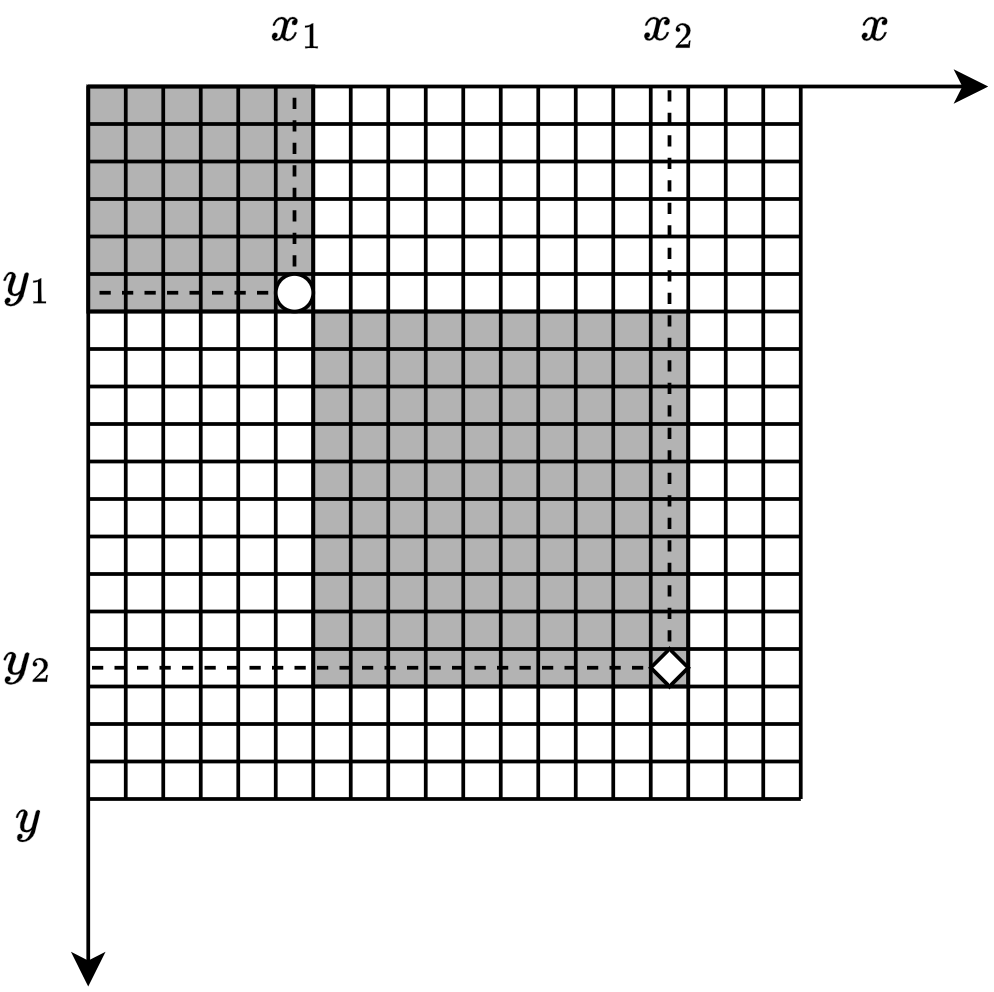

## 🚫 Restrições
⚠️ Apenas a biblioteca NumPy pode ser utilizada.

⚠️ Não altere a assinatura da função.

⚠️ Não inclua código de teste no arquivo enviado.

⚠️ Não use OpenCV, PIL, scipy, etc.

## 📎 Instruções de Entrega
Submeta o arquivo student_integral_image_numpy.py contendo apenas a implementação.

Certifique-se de que sua função retorna corretamente o resultado conforme o exemplo.

A correção será automatizada, portanto o nome da função e o formato devem ser respeitados.

## 📝 Enunciado

A imagem integral, também chamada de **tabela de soma acumulada**, é uma técnica utilizada para acelerar operações sobre regiões retangulares de uma imagem. O valor da imagem integral em uma posição $(x, y)$ representa a soma de todos os pixels localizados acima e à esquerda (inclusive) daquela posição na imagem original:

$
I_{\text{int}}(x, y) = \sum_{i=0}^{x} \sum_{j=0}^{y} I(i, j)
$


Essa estrutura de dados é fundamental para acelerar algoritmos de visão computacional, como o **Viola-Jones**, permitindo calcular a soma de qualquer retângulo da imagem em tempo constante.

---

## 🎯 Objetivo

Implemente uma função em Python utilizando **apenas a biblioteca NumPy** que receba como entrada uma imagem em tons de cinza (2D) e retorne sua **imagem integral**.

---

## 🔧 Especificação da Função

Você deverá modificar o arquivo `student_integral_image_numpy.py` contendo a seguinte função:

```python
def compute_integral_image(image: np.ndarray) -> np.ndarray:
    """
    Calcula a imagem integral usando NumPy.

    Parâmetros:
        image (np.ndarray): Matriz 2D representando uma imagem em tons de cinza.

    Retorno:
        np.ndarray: Matriz 2D da mesma forma, contendo a imagem integral.
    """
    # Sua implementação aqui
```

## ⭐ Questão Bônus
Pergunta:
Explique como a imagem integral é usada para acelerar o algoritmo de detecção de objetos com Haar Cascades, como no método Viola-Jones. Por que ela é fundamental para viabilizar a execução em tempo real?


